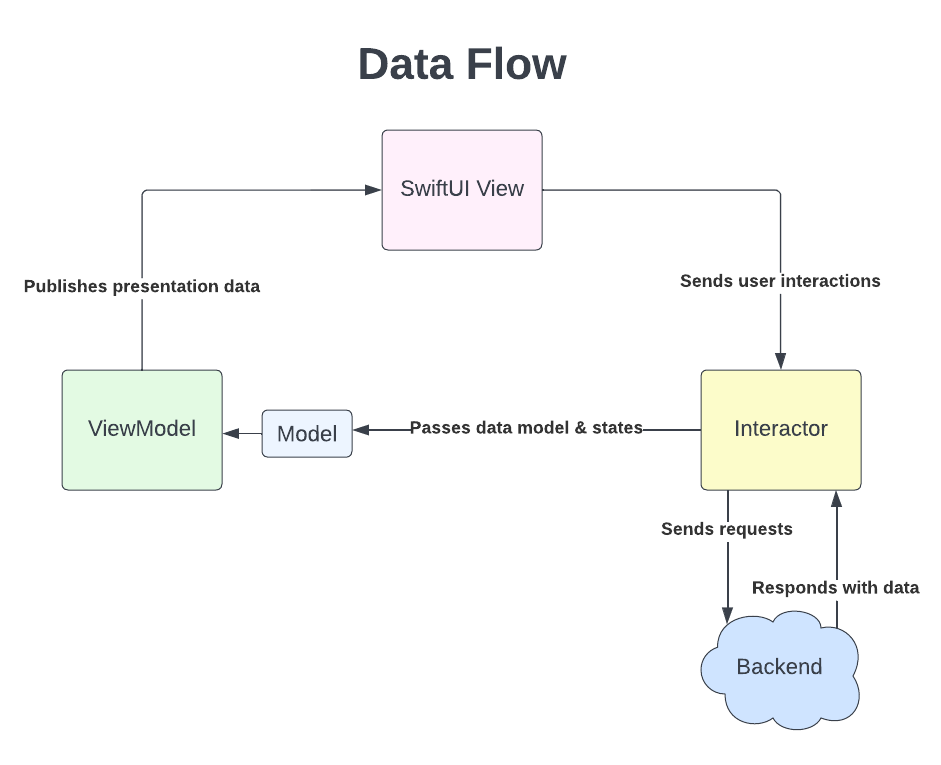
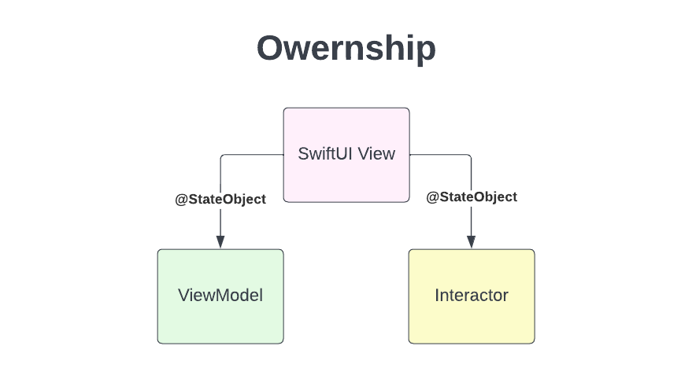

# Overview
At a high-level the architectural patterns used are composed of the following pieces:
  - [iMVVM with SwiftUI](#imvvm-with-swiftui)
  - [Dependency Injection](#dependency-injection)
  - [Plugins](#plugins)

# iMVVM with SwiftUI
This section describes each of the components and how they should be used. The source code in the Blueprint app is
built using this architecture and can be used as a source code reference.



[Source Lucid chart](https://lucid.app/lucidchart/1598fe18-df29-4243-bb04-d92df74e1a6b/edit?viewport_loc=-11%2C-11%2C1753%2C1768%2C0_0&invitationId=inv_2b437cc5-d5a6-4841-a7f2-9a5035b01cd3#)

## Model
Model is the data model representing the raw data. This is generally returned from the backend or loaded from the disk
cache. Models are typically generated by some code generator such as the [GQL generator](#gql-generator-integration).

## View
View is the UI component that utilizes Apple's UI frameworks. In almost all cases, views should be written with the
modern [SwiftUI](https://developer.apple.com/documentation/swiftui/) framework. At the time of writing, SwiftUI does
lack some features and flexibilities compared to the old UIKit framework. However given that it is clearly the
direction Apple is pushing, it is reasonable and more future-proof to adopt it. In rare cases where SwiftUI cannot
satisfy the product needs, UIKit may be used and then embedded into a SwiftUI view hierarchy.

### TypeErasedView
`TypeErasedView` is a drop in replacement for SwiftUI's `AnyView`. `AnyView` has two major issues that the
`TypeErasedView` solves:
  1. A view hierarchy containing many `AnyView` instances can have rendering performance issues.
  2. Wrapping an `AnyView` within another `AnyView` can erase certain modifiers such as `onAppear` and `onDisappear`.
  This is quite error-prone as different portions of the codebase can unintentionally cause more than one wrapping.

Using a `TypeErasedView` enables many architectural benefits:
  1. Each feature can be written in its own package without exposing the individual classes as `public`. A single
  `public` factory can be used to return a `TypeErasedView` to the parent view package for presentation.
  2. A parent feature containing many child views does not need to be modified when new child views are added or
  modified, when the child views are constructed as [plugins](#plugins).
  3. A view/feature's lifecycle can be managed by retaining and releasing the `TypeErasedView` reference.

## ViewModel
ViewModel is a helper object that encapsulates the logic of transforming data models into presentation models that the
view can display. In SwiftUI, ViewModels are `ObservableObject` types that publish presentation data to views. It is
important to note that ViewModels should not handle business logic such as network or user interactions. That logic
is encapsulated by the [Interactor](#interactor).

Presentation data is not only texts and images that are displayed on the screen. It also includes states of the view
such as navigation states. For example, a ViewModel may publish an enum property. The corresponding view observes the
property and shows different subviews depending on the value of the property. In this case, the ViewModel's property
can be considered as view states.

ViewModels are optional objects in this architecture. Not all Views have a corresponding ViewModel. Simple views that
encapsulate static UI elements do not have to have a corresponding ViewModel.

## Interactor
An Interactor is an object, typically a class, designed to encapsulate the application business logic such as network
and user interactions. An interactor may subscribe to a network data stream to fetch models from the backend as a view
first appears. It may send network requests to the backend when a user performs an action. After network data is
received, the Interactor passes this data to the ViewModel. The ViewModel then transforms the network data into
presentation data for the View to observe and display.

An Interactor is bound to the lifecycle of its corresponding View. As the view appears and disappears, the Interactor's
`onLoad`, `onViewAppear` and `onViewDisappear` functions are invoked accordingly. These functions are overridable,
providing extension points for the concrete implementations to perform various logic during these different lifecycle
stages. Concrete implementations of Interactor should extend from the base `Interactor` or `ViewModelInteractor` class
in the `IMVVMFoundation` package, depending on if the interactor has an associated ViewModel.

Interactors are optional objects in this architecture. Not all Views have a corresponding Interactor. Simple views that
encapsulate static UI elements do not have to have a corresponding Interactor.

## Ownership
As the diagram above illustrated, the ownership of View, ViewModel and Interactor flow in the opposite direction as the
data. View owns both ViewModel and Interactor. Interactor receives a reference to its ViewModel via its lifecycle
methods such as `onLoad`, `onViewAppear`, etc. Interactors do not directly own their ViewModels.

---
**IMPORTANT**

A View must reference its Interactor and ViewModel via the `@StateObject` property wrapper. This allows SwiftUI to
properly manage the ownerships.
```
@StateObject var interactor: MyInteractor
@StateObject var viewModel: MyViewModel
```
Please see [Why use @StateObject for Interactor and ViewModel](#why-use-stateobject-for-interactor-and-viewmodel) below for detailed reasoning.

---

## Initialization
In order to decouple all the different types, initialization should be performed via a factory pattern. This means
none of the types, View, ViewModel or Interactor directly instantiates any other types. Instead a separate factory is
used to instantiate each type and constructor inject them into each other. This factory is generally the component
object in the [Dependency Injection](#dependency-injection) system. For example:
```
public class MyComponent: Component<MyDependency> {
  public func make() -> some View {
    MyView(interactor: MyInteractor(...), viewModel: MyViewModel(...))
  }
}
```

---
**IMPORTANT**

The initialization of Interactor and ViewModel must be embedded within the initialization of their owning View. This
allows the `@StateObject` property wrapper to correctly track the references. Initializing either outside of the
View's initialization will result in memory-leaks.
```
public class MyComponent: Component<MyDependency> {
  public func make() -> some View {
    let interactor = MyInteractor(...) // !!! Memory-leak !!!
    return MyView(interactor: interactor, viewModel: MyViewModel(...))
  }
}
```
Please see [Why embed Interactor and ViewModel initialization](#why-embed-interactor-and-viewmodel-initialization) below for detailed reasoning.

---

If the feature does not have a DI component, then a custom factory object can be created to provide the same
`make` function implementation as above.

## Lifecycle
Lifecycle refers to different stages of an object that can be used to perform different operations.

### View
The View's lifecycle is directly controlled by SwiftUI. It has four stages: `init`, `onAppear`, `onDisappear` and
`deinit`. Generally a view does not need to utilize these stages beyond the most obvious cases. `let` properties are
set during the `init` stage and released during the `deinit` stage.

### ViewModel
The ViewModel only has two stages, `init` and `deinit`. Generally a ViewModel only needs to be aware of the `init`
stage. It sets initial values for its published properties.

### Interactor
The Interactor has five stages that it can use to perform business logic: `init`, `onLoad`, `onViewAppear`,
`onViewDisappear` and `deinit`. The `init` stage should only involve setting `let` properties and initial values. The
`onLoad` stage can be used to setup persistent operations such as subscriptions to data streams. It can also utilize
this stage to perform initial network requests. The `onViewAppear` stage can be used to perform business logic that is
only required after its corresponding view has appeared on the screen. Similarly the `onViewDisappear` stage can be
used to perform business logic that is only required after its corresponding view has disappeared from the screen.
Finally the `deinit` stage can be used to release any resources.

For Combine subscriptions, the Interactor base implementation provides utility operators that help bind a
subscription's lifecycle to either the Interactor's `onViewDisappear` or `deinit` lifecycle. This allows the
subscription to be automatically cancelled when either the corresponding view disappears or the interactor deinits.
```
@CancellableBuilder
override func onLoad(viewModel: MyViewModel) -> [AnyCancellable] {
  publisher
    .sink {
      ...
    }
    .bindToDeinit(of: self) // self is the interactor instance.
}
```
```
@CancellableBuilder
override func onViewAppear(viewModel: MyViewModel) -> [AnyCancellable] {
  publisher
    .sink {
      ...
    }
    .bindToViewDidDisappear(of: self) // self is the interactor instance.
}
```

If the Interactor does not have a corresponding ViewModel, it should inherit from the `Interactor` base class instead
of the `ViewModelInteractor` class. The lifecycle methods are the same, except in this case the `viewModel` parameter
is omitted.

### Tying everything together
Both ViewModel and Interactor are tied to the lifecycle of the View. This means that fundamentally there is only a
single lifecycle driven by SwiftUI directly.

---
**IMPORTANT**

A View that has an Interactor must bind the interactor via the `bind(observer:)` or `bind(observer: viewModel:)`
modifier of the view. This establishes the lifecycle connection between the View, the Interactor and the ViewModel.
This operation must be performed within the View's `body` property.
```
struct MyView<Interactor: ViewWithModelLifecycleObserver<MyViewModel> & MyViewHandler>: View {
  @StateObject var interactor: Interactor
  @StateObject var viewModel: MyViewModel

  var body: some View {
    content
      .bind(observer: interactor, viewModel: viewModel)
  }
}
```
```
struct MyView<Interactor: ViewLifecycleObserver & MyViewHandler>: View {
  @StateObject var interactor: Interactor

  var body: some View {
    content
      .bind(observer: interactor)
  }
}
```
---

## Decoupling View and Interactor
There are many reasons why it is a good practice to decouple the View from its Interactor's concrete implementation.
The [SwiftUI previews](#swiftui-previews) section below demonstrates such a use case. The decoupling can be simply
implemented via an interactor protocol. The View only references the protocol and never the concrete implementation.
The implementation can conform to the protocol.

### In the view file
```
protocol MyViewHandler {
  func doStuff(viewModel: MyViewModel)
}

struct MyView<Interactor: ViewWithModelLifecycleObserver<MyViewModel> & MyViewHandler>: View {
  @StateObject var interactor: Interactor
  @StateObject var viewModel: MyViewModel

  var body: some View {
    Button("My Button") {
      interactor.dofStuff(viewModel: viewModel)
    }
  }
}
```

### In the interactor file
```
class MyInteractor: Interactor, MyViewHandler {
  func doStuff(viewModel: MyViewModel) {
    ...
  }
}
```

## SwiftUI previews
SwiftUI previews can significantly improve the development process of SwiftUI views. The iMVVM architecture is
designed to support building SwiftUI previews. The previews can be created by providing fixture ViewModel data and
mocked Interactor types.

```
class MyViewModel: ObservableObject {
  @Published var ...
  ...
}
protocol MyViewHandler {
  func doStuff(viewModel: MyViewModel)
  ...
}
struct MyView<Interactor: ViewWithModelLifecycleObserver<MyViewModel> & MyViewHandler>: View {
  @StateObject var interactor: Interactor
  @StateObject var viewModel: MyViewModel
}

#if DEBUG
  class MyViewPreviewsInteractor: ViewModelInteractor<MyViewModel> MyViewHandler {
    func doStuff(viewModel: MyViewModel) {
      viewModel.property = "new value"
    }
  }

  struct MyViewPreviews: PreviewProvider {
    static var previews: some View {
      MyView(interactor: MyViewPreviewsInteractor(), viewModel: MyViewModel())
    }
  }
#endif
```

## Further details
This section provides further details on some of the information described above.

### Why use @StateObject for Interactor and ViewModel
In SwiftUI `@StateObject` is used to declare a View is the owner of an object. At runtime, SwiftUI replaces old
instances of Views with new ones when the contents of the View changes. By declaring an Interactor with the `@StateObject`
property wrapper, SwiftUI ensures the same instance of the Interactor is retained in memory and linked to the new
instance of the View when such a replacement occurs.

Because Interactors are typically stateful, this ensures the data already fetched from the backend is retained properly.
Otherwise unnecessary data fetches would have to occur for a new instance of the Interactor to populate the View. The
exact same reasoning applies to the ViewModel as well.

Beyond properly retaining state, because the Interactor is bound to the View's `onAppear` and `onDisappear` lifecycle
methods, the Interactor only "activates" when the View's `onAppear` method is invoked by SwiftUI. When a View instance
is replaced by SwiftUI due to content changes, as SwiftUI considers the two instances of the View are the same, the new
View instance's `onAppear` method is NOT invoked after the replacement. This means if the Interactor is not referenced
as a `@StateObject`, a new instance of Interactor is created but it will never "activate" to perform any work. A clear
symptom of this issue is after a View's content changes, the View gets stuck in its loading state.

### Why embed Interactor and ViewModel initialization
A quirk of the `@StateObject` property wrapper is that its initializer is declared with `@autoclosure`. When an
Interactor or ViewModel is declared an `@StateObject` and passed into the View's initializer, whatever is passed in
is automatically wrapped with a closure. This allows the `@StateObject` property wrapper to lazily instantiate the
actual object after the View has been properly installed in the view hierarchy.

If an instance of the Interactor is instantiated outside the View's initializer:
```
func make() -> some View {
  let interactor = MyInteractor()
  return MyView(interactor: interactor)
}
```
SwiftUI would retain that instance via the closure. The first time when the View and its Interactor is instantiated,
everything works as expected. Once the View updates and SwiftUI instantiates the second instances however, a
memory-leak would occur. As the function that instantiates the View and Interactor is invoked for the second time, a
new instance of the Interactor and a new instance of the View is created. SwiftUI first replaces the old instance of
the View with the new instance. At this time, only a single instance of the View exists. The old instance of Interactor
is still retained by `@StateObject`, and so is the new instance. SwiftUI then installs the old instance of Interactor
to the new instance of the View as expected. This completes the update process. However, the new instance of Interactor
which has already been created before the replacement even occurs, is still retained by the `@StateObject` closure,
as `@StateObject`s are managed as a global cache by SwiftUI. This leaks the new instance of the Interactor.

If the Interactor is properly initialized by embedding into the View's initializer:
```
func make() -> some View {
  MyView(interactor: MyInteractor())
}
```
whenever the function is invoked, no instances of the Interactor is actually created. The `@autoclosure` only retains
the initializer function of the Interactor. Once the replacement is completed, no new instances of the Interactor was
ever created. Therefore, no memory-leak!

## Alternatives
This architectural pattern provides a reasonable separation between data, view and business logic without adding too
much complexity or overhead. For comparison with other patterns, please see the [Alternative architectures](#alternative-architectures)
section below.

# Dependency Injection
Dependency injection, or DI, is used to decouple unrelated code and enable unit testing. Instead of coupling classes
together with concrete implementations, DI should be used to link disparate code together.

In order to achieve compile-time safety, the framework [Needle](https://github.com/uber/needle) is used. For further
details on the benefits of using DI, please see Needle's [documentation](https://github.com/uber/needle/blob/master/WHY_DI.md).

Please refer to Needle's official documentation on how to use the framework.

As mentioned above, the DI component of a feature generally acts as the factory of the feature. It declares a `make`
function that returns the View with its Interactor already bound.
```
public class MyComponent: Component<MyDependency> {
  public func make() -> some View {
    MyView(interactor: MyInteractor(), viewModel: MyViewModel())
  }
}
```

## Scopes
Scopes naturally emerge with iMVVM and DI patterns. A scope can be defined generally in three ways:
  - An iMVVM set of classes.
  - A node in the DI graph.
  - A state in the application.

For example, a basic app can be divided into `LoggedIn` and `LoggedOut` scopes. From an iMVVM perspective, each scope
has their own iMVVM objects such as `LoggedInView`, `LoggedInViewModel`, etc. From a DI perspective, both `LoggedIn`
and `LoggedOut` represent nodes in the DI graph. Using Needle specific terminologies, there is a `LoggedInComponent`
and a `LoggedOutComponent`. From an application state perspective, the `LoggedIn` scope represents the state where the
user has successfully signed into the app, whereas the `LoggedOut` scope represents the state when the user has not
been authenticated.

# Plugins
The plugin pattern allows separation between disjointed parts of the application to be decoupled yet integrated with
clean interfaces. The architectural approach we decided on is that "(almost) everything is a plugin". This means every
set of features such as items in a feed, tabs in a tab view are implemented as plugins. Utility objects such as
workers objects can also be plugins.

Each plugin has its own feature flag. The plugin is only instantiated and integrated with its parent if the
corresponding feature flag is turned on. All plugins are defaulted to the "on" state. This means when the feature flag
framework fails to retrieve a value for a specific feature flag, the associated plugin is by default instantiated and
integrated. This optimistic approach of assuming feature flags are default "on" simplifies the understanding of most
runtime code paths. At the same time any instabilities in the feature flag framework will not affect the entire app.
This implies turning off a plugin is a best-effort operation, due to the potential instabilities in the feature flag
framework.

Please refer to the `PluginFramework` package for the base implementations. Most commonly, a set of SwiftUI `View`
based structures such as `Plugin` and `ForEachPlugin` provide integrations between standard SwiftUI `View` and the
plugin pattern.
```
struct ParentView: View {
  let pluginViewBuilder: (MyFeatureFlag) -> TypeErasedView

  var body: some View {
    ForEachPlugin(featureFlags: MyFeatureFlags.allCases, viewBuilder: pluginViewBuilder)
  }
}
```

# Xcode Project Generation & Tools Integration
In order to codify the Xcode project configurations and avoid project file merge conflicts, all apps' Xcode projects
should be generated from manifest files. (Tuist)[https://docs.tuist.io/] is a good tool for project generation.

In order to create a new app, a `Project.swift` manifest file should be created to define the structure and
configuration of the Xcode project. Please refer to
[Tuist's documentation](https://tuist.github.io/tuist/latest/documentation/projectdescription/project/) for details.
The manifest file for the Blueprint app can be used as a quick-start reference.

## Needle generator integration
To streamline the local development process, it is generally a best practice to integrate Needle DI code generation
with the Xcode project. Because DI code is both required to compile the application and verify the DI graph is setup
correctly, it needs to be integrated as both the app scheme's pre-build action and the target's pre-build phase. In
order to fail the build process in case the DI graph is not properly setup, the pre-build phase integration is used.
This helps to detect DI graph issues such as missing dependencies during local development. Xcode scheme's pre-action
does not fail the build process regardless of the result from the integrated actions.

### Scheme pre-build action
```
schemes: [
    Scheme(
      name: "APP_NAME",
      shared: true,
      buildAction: .buildAction(
        targets: ["APP_TARGET_NAME"],
        preActions: [
          ExecutionAction(
            title: "Generate Needle",
            scriptText: "cd \"$SRCROOT\" && /usr/local/bin/needle-generator \"$SRCROOT\"/needle.json",
            target: "APP_TARGET_NAME"
          ),
...
```

### Target pre-build phase
```
targets: [
    Target(
      name: "Otter",
      platform: .iOS,
      scripts: [
        .pre(script: "cd \"$SRCROOT\" && /usr/local/bin/needle-generator \"$SRCROOT\"/needle.json", name: "Generate Needle"),
      ],
...
```

## GQL generator integration
Since application code relies on GQL generated code to compile, it is generally a best practice to integrate the GQL
generator with the Xcode project to streamline the development process. Unlike Needle however, GQL generation is a
slower process. Because of this, it is better to only integrate it as the app scheme's pre-build action. This means
that if the generation process fails due to validation errors, the build process will not be affected. Fortunately, in
most scenarios, if the generation fails, the application source code would not compile properly either.

### Scheme pre-build action
```
schemes: [
    Scheme(
      name: "APP_NAME",
      shared: true,
      buildAction: .buildAction(
        targets: ["APP_TARGET_NAME"],
        preActions: [
          ExecutionAction(
            title: "Generate GQL",
            scriptText: "cd \"$SRCROOT\" && /usr/local/bin/gql-generator \"$SRCROOT\"",
            target: "APP_TARGET_NAME"
          ),
...
```

# Mock Generation
In order to write unit tests, mocks are necessary in most cases. [Mockingbird](https://github.com/birdrides/mockingbird)
is a good tool to provide this functionality.

There are times where the generated mocks are insufficient for the tests cases. In these cases, manually writing mocks
is the solution.

# Additional Context
This section provides additional context on the decisions described above. This information isn't crucial in developing
iOS apps. It is provided here for prosperity.

## Alternative architectures
The following alternatives were considered and compared to the chosen iMVVM pattern.

### RIBs
For large scale apps that concentrates many features into a single UI, such as Uber, RIBs is a great pattern to use.
For most other apps, smaller or has natural UI separation of concerns, RIBs is too complicated for the job.

### MVC/(B)VIPER
MVC isn’t really applicable for the SwiftUI world. It is also pretty much the same as the chosen iMVVM pattern anyways.
(B)VIPER is a more complex and more boilerplate version of MVx. It doesn’t really provide much advantages over iMVVM
given iMVVM already has good separation of concerns.

## Uber's core vs non-core approach of plugins
At Uber, apps were partially built as plugins. Some features are built directly without using the plugin API. It aimed
to address the distinction between “core” features and “non-core” features. The downsides of this approach are:
- Inconsistency across different parts of the app.
- Disagreements around what is core and what is non-core.
- Core features cannot be turned off.
To address these issues, the proposal is to build all the features of the app as plugins!

The app contains a basic structure of starting up. From there on, all features are built as plugins. From an
architectural perspective, the distinction between core and non-core is completely removed. Only the skeleton of the
app remains outside of the plugin API.

## Uber's default off approach of plugins
Drawing from the experience at Uber, it is very difficult to reason about what the end user actually sees since all
plugins are default off. And because the backing feature flag system cannot be 100% reliable, some users may be left
in a broken state without us even knowing.

Instead of being pessimistic about our own code, we choose to be optimistic. All plugins are default on! Each plugin
has a feature flag automatically generated on the client side. In case of outages, engineers may configure the backend
feature flag service to turn off plugins. Since the plugin service is not 100% reliable, turning off plugins is a best
effort operation.
